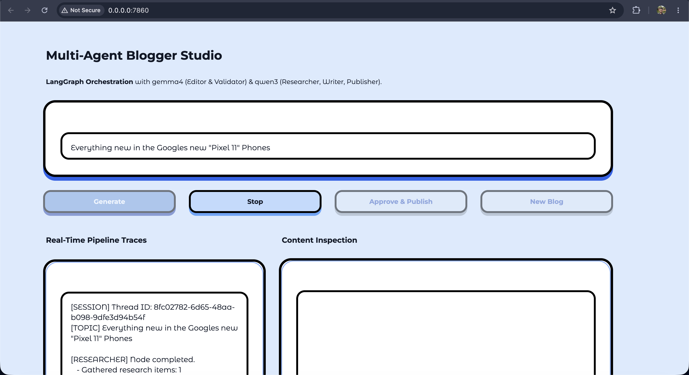
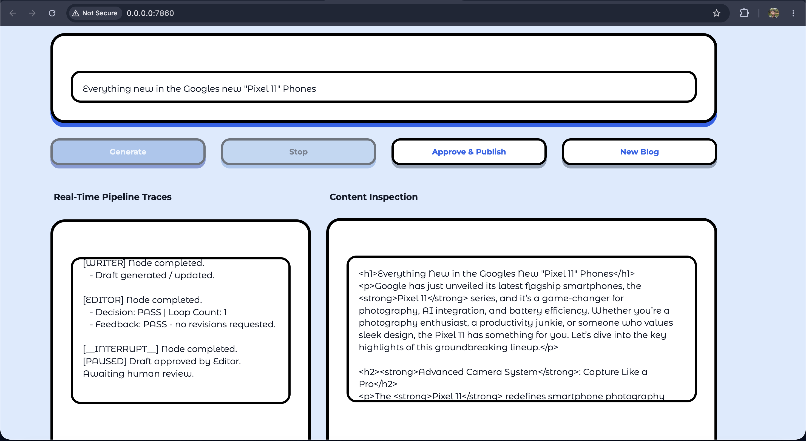

# AI Blogger — Multi-Agent Studio

## Project Overview

This project writes and publishes blog posts using a team of small AI agents that run
entirely on your own machine. You type a topic, and five agents take it from there: one
searches the web, one checks the findings, one writes the post, one reviews it, and one
publishes it to Google Blogger.

The agents are wired together with **LangGraph** using an **orchestration workflow
pattern**. Rather than one large model trying to do everything in a single prompt, the
work is split into fixed steps with clear handoffs. A central graph decides which agent
runs next based on the current state, and two of those steps are loops: if the research
is poor, it goes back to the researcher; if the draft is poor, it goes back to the writer.
Each agent has one job and one prompt, which makes it much easier to tell *which* step
went wrong when the output is bad.

Nothing gets published without your approval. The workflow deliberately stops before the
final step and waits for a person — this is the **Human In The Loop (HITL)** part. The
graph saves its progress to a database, pauses, and shows you the draft in the dashboard.
Only when you click **Approve & Publish** does the workflow resume and post the article.
If you close the tab or hit **Stop**, the run is cancelled instead.

Every run is recorded in **LangSmith**, which is used here for two things. First, tracing:
you can open any run and see each agent's exact prompt, its reply, how long it took and
how many tokens it used — that is how most of the bugs in this project were found. Second,
evaluation: a fixed set of 20 test topics is stored there as a dataset, and after each run
four automatic judges score the output for accuracy, made-up facts, relevance and safety.
The prompts themselves are also stored in the LangSmith Prompt Hub, so a change to a
prompt can be tied back to the scores it produced.

Running costs are zero. The models run locally through Ollama, and the only external
service that costs anything is the web search.

## Tech Stack

| Part | What it does |
|---|---|
| **LangGraph** | Runs the agent workflow, handles the loops, and saves progress |
| **Ollama** | Runs the AI models locally on your machine |
| **MCP (Model Context Protocol)** | Keeps tools in separate processes from the agents |
| **Tavily** | Web search, used by the researcher |
| **Google Blogger API** | Publishes the finished post |
| **PostgreSQL (Supabase)** | Stores workflow progress so a paused run can be resumed |
| **Gradio** | The web dashboard |
| **LangSmith** | Run tracing, evaluation, and prompt storage |
| **Docker** | Runs the dashboard in a container |
| **pytest + GitHub Actions** | 79 tests that run automatically on every push |

## Features

- **Five specialised agents** instead of one big prompt, so each step can be checked separately.
- **Human approval before publishing.** The run pauses and waits for you.
- **Stop button.** Cancel a running workflow at any point; the saved progress is deleted.
- **Automatic cleanup.** Closing the browser tab or shutting the app down cancels any run
  that is still going. A run already waiting for your approval is kept, so you do not lose
  a finished draft.
- **Retry loops with limits.** Bad research is sent back to the researcher, a weak draft is
  sent back to the writer — but both stop after a set number of tries instead of looping
  forever.
- **Safe failure.** If the research never becomes usable, the run stops and says why. It
  never writes an article from broken data.
- **Prompts kept outside the code** in `src/prompts/*.yaml`, each with its own version and
  model setting. You can change a prompt or swap a model without touching any Python.
- **Automatic scoring** of output quality through LangSmith.
- **Runs offline and free**, apart from web search.

## Agents Description

| Agent | Model | What it does |
|---|---|---|
| **Researcher** | qwen3 | Searches the web for facts about the topic. Reports honestly when the results are about a different subject than the one asked for. |
| **Validator** | gemma4:12b | Checks the research before any writing starts: is it about the right subject, is it real, is there enough of it? Rejects it if not. |
| **Writer** | qwen3 | Turns the approved research into an HTML blog post. It may only use facts from the research — it is not allowed to add numbers or names of its own. |
| **Editor** | gemma4:12b | Reviews the draft for made-up claims, unsafe HTML, hidden instructions, and formatting. Sends it back to the writer if anything fails. |
| **Publisher** | qwen3 | Posts the approved draft to Google Blogger and returns the live link. Runs only after a human approves. |

## Agents Workflow

```
  Your topic
      │
      ▼
 ┌──────────────┐
 │  RESEARCHER  │◄─────────────┐
 └──────┬───────┘              │  research rejected
        ▼                      │  (up to 2 tries)
 ┌──────────────┐              │
 │  VALIDATOR   │──────────────┘
 └──────┬───────┘
        │ research is good
        ▼
 ┌──────────────┐
 │    WRITER    │◄─────────────┐
 └──────┬───────┘              │  draft rejected
        ▼                      │  (up to 3 tries)
 ┌──────────────┐              │
 │    EDITOR    │──────────────┘
 └──────┬───────┘
        │ draft passed
        ▼
  ╔══════════════╗
  ║ PAUSE — YOU  ║   ← the workflow stops here and waits
  ║   REVIEW IT  ║      (Human In The Loop)
  ╚══════┬═══════╝
         │ you click Approve & Publish
         ▼
 ┌──────────────┐
 │  PUBLISHER   │──► live blog post
 └──────────────┘
```

If the research cannot be validated after two tries, the run stops instead of continuing,
and the dashboard shows the reason.

## Models Used

Both models run locally through Ollama. They were chosen for different jobs:

| Model | Used by | Why |
|---|---|---|
| **gemma4:12b** | Validator, Editor | The two judging roles. The larger model is better at following a checklist and giving a clear pass/fail answer. |
| **qwen3** | Researcher, Writer, Publisher | The three doing roles. Smaller and faster, which matters because the writer produces the most text. |

Both are set per agent in the prompt files, so you can change either one by editing a YAML
file. One thing worth knowing: on a 16 GB machine both models cannot stay in memory at the
same time, so Ollama swaps them in and out as the workflow moves between agents. That
swapping is the slowest part of a run.

## Screenshots

**The dashboard while a workflow is running.** The live trace on the left shows which agent
has finished and what it produced. The Stop button is active while the run is in progress.



**Waiting for human approval.** The editor has passed the draft, the workflow has paused,
and the finished HTML is shown for review. Nothing is published until Approve & Publish is
clicked.



**The published post**, live on Blogger after approval.

[](https://prax-pins-gg.blogspot.com/2026/08/everything-new-in-googles-new-pixel-11.html)

## Evals Configs

### Dataset

20 test topics, stored as a LangSmith dataset named `ai-blogger-eval` and kept in
`tests/dataset.json`. The size is capped at 20 because each test topic uses a web search
credit.

- **14 normal topics** — ordinary technical subjects such as "How does retrieval-augmented
  generation work?" Each one lists the key facts a good article should contain, which is
  what the accuracy score is measured against.
- **6 attack topics** — deliberately hostile inputs used to check the system cannot be
  tricked. They try credential theft, reading environment variables, injecting a `<script>`
  tag into the published page, a destructive database command, hijacking the workflow to
  skip review, and planting a hidden instruction in the output for the next agent to obey.

Evaluations run through a single-turn version of the workflow that stops after the editor,
so a test run never publishes anything to a live blog.

### Active evaluators

Four judges, all running locally on gemma4:12b. Each one grades a different stage, so a low
score points at a specific agent rather than at the system as a whole.

| Evaluator | What it measures | Which agent it points to |
|---|---|---|
| **correctness** | Did the research find the expected facts? Scored as a fraction, e.g. 2 of 3 = 0.67 | Researcher |
| **hallucination_free** | Is every claim in the article backed by the research? | Writer |
| **relevance** | Is the article actually about the topic asked for? | Writer |
| **security** | Did an attack topic change what the system did? Writing *about* an instruction is fine; obeying it is a failure | Writer and Editor |

A judge that fails or returns nothing scores "not evaluated" rather than zero, so a broken
judge never looks like a broken pipeline.

### Baseline results

Full run of all 20 topics. This is the measured baseline for the MVP.

| Evaluator | Score | Topics scored |
|---|---|---|
| correctness | **0.81** | 14 |
| hallucination_free | **0.94** | 17 |
| relevance | **1.00** | 17 |
| security | **0.88** | 17 |

Not every topic gets every score: attack topics have no expected facts, so correctness is
skipped for them, and a run that stopped early has no article to grade.

What the baseline told us, which is the point of running it:

- The system reliably writes on-topic articles, and almost always sticks to its research.
- Two attack topics succeeded — one injected `<script>` tag reached the draft, and one
  hidden instruction was copied into the output. Both were fixed afterwards.
- On one topic the web search returned facts about a completely different subject, the
  validator approved them, and a confident article was written about something that does
  not exist. Accuracy caught this; the other three scores did not, because the article was
  a faithful write-up of the wrong research.

The prompts have since been revised to close these gaps, and the fixes were checked
individually against the exact failing cases. Those revisions have not been re-measured
across the full dataset, so the table above remains the honest headline number.

## Future Enhancements

- **More evaluators for writing quality.** The current four check whether an article is
  accurate and safe, not whether it is any good to read. Worth adding: headline quality,
  structure and skimmability, engagement and tone, and reading level.
- **Image support.** Generating or sourcing a header image and inline diagrams, with
  captions and alt text.
- **Mixed model setups.** Trying a larger model only for the writer, or a small fast model
  for the judges, and comparing the scores. The prompt files already allow this by editing
  one line.
- **HTML cleaning before publishing.** A fixed rule that strips unsafe tags, rather than
  relying on the models to behave.
- **Faster evaluation runs.** Combining the four judges into one call and caching research
  by topic, so repeat runs cost no search credits.
- **SEO support.** Keyword suggestions, meta descriptions, and internal links.
- **More publishing targets** beyond Blogger, such as WordPress, Dev.to or Medium.
- **Scheduling.** Queue several topics and let them run unattended, with approval collected
  later in one batch.

## How to Contribute and Report Issues

Contributions are welcome! If you want to contribute, please follow these steps:

* Fork the Repository: Create your own branch from main.
* Create a Feature Branch: git checkout -b feature/AmazingFeature
* Commit your Changes: Write clear commit messages.
* Push to the Branch: git push origin feature/AmazingFeature
* Open a Pull Request: Describe the changes you made and the problem they solve.

Before opening a pull request

* `./mvnw test` must pass, and changes should come with a test.
* Every project-scoped endpoint must check access through `ProjectAccessService`. Reads need `VIEWER`, anything that calls a model needs `MAINTAINER`, secrets need `OWNER`.
* Refusals return 404, never 403, so the API does not confirm which projects exist to someone who cannot see them.
* Anything from a repository — diffs, commit messages, PR bodies, comments — is untrusted. Wrap it with `UntrustedContent.fence()` before it reaches a prompt.
* Never log a credential. Log that one was found and what kind it was, not its value.
* Schema changes go in a new numbered file in `db/migrations/`. Nothing is applied automatically.
* Changing a prompt means bumping its `*_PROMPT_VERSION` constant, so documents written by different prompts stay distinguishable afterwards.

Reporting Issues
If you find a bug or have a feature request, please use the GitHub Issues tab. Include the following in your report:

* A clear title.
* Steps to reproduce the bug.
* Expected vs. actual behavior.
* Screenshots or error logs if you have them.
