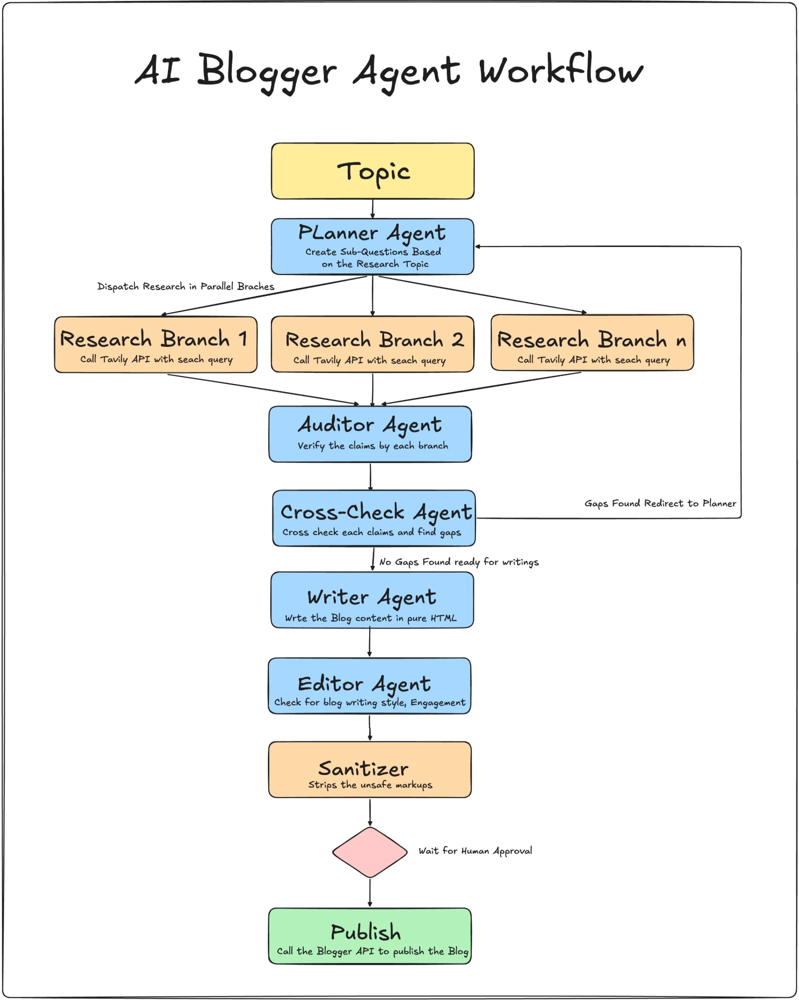
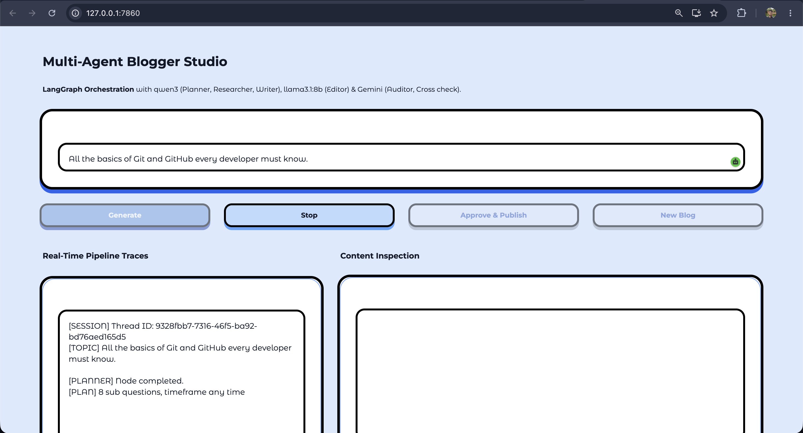
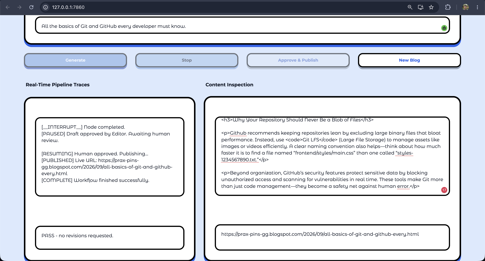
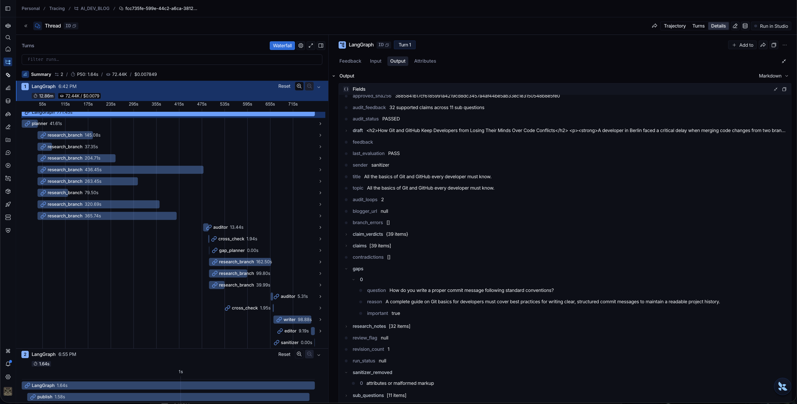
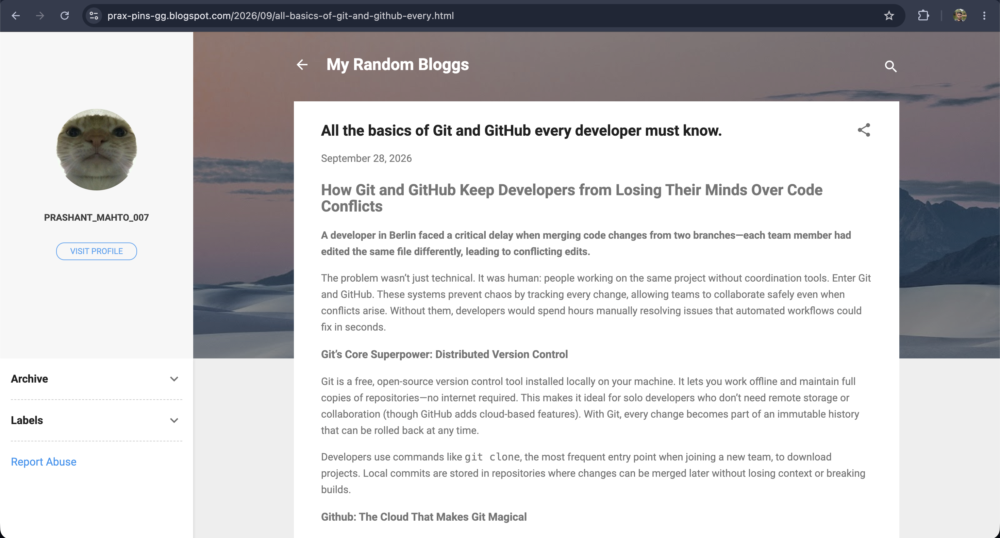

# AI Blogger: Multi-Agent Studio

A team of small AI agents that researches, fact checks, writes and publishes technical blog
posts, running on a 16 GB laptop. Every fact in a post traces to a verbatim quote on a real
web page, and nothing is published until a person approves it.

- **Local first.** Planning, research and writing run on local models through Ollama. Only
  fact checking uses a hosted model (Gemini), because it needs current knowledge.
- **Checked claim by claim.** Code confirms each quote is really on its page; Gemini then
  judges whether the quote supports the claim. Unsupported claims never reach the writer.
- **Human in the loop.** The workflow saves its state to Postgres, pauses before publishing,
  and resumes only when you click **Approve & Publish**.

**[Live replay demo on Hugging Face](https://huggingface.co/spaces/Prashant-Mahto/AI-Blogger-Demo)**: step through three recorded runs, including an attack topic. No setup, keys or models needed.

## Workflow



1. **Planner** splits the topic into 5 to 8 sub questions and pins the time period it
   implies ("the last decade" becomes 2016 to 2026).
2. **Research branches** run in parallel, one per sub question: one Tavily search, the most
   relevant 1,500 characters of each page, and up to 4 claims, each with a verbatim quote.
3. **Auditor** (Gemini) judges every claim against its own quote. Claims dated outside the
   time period are dropped by code. A run needs 5 supported claims across 3 sub questions,
   or it stops and says why.
4. **Cross check** (Gemini) reads all supported claims together, flags sources that
   disagree, and can send up to 3 new questions back for one extra research round.
5. **Writer** turns the audited notes into an HTML post sized to the research (about 40
   words per note), opening on a real fact.
6. **Editor** judges how the post reads and sends it back for up to 3 revisions.
7. **Sanitizer** keeps only safe HTML tags, and flags any number in the draft that no note
   contains.
8. **You review** the draft, then **Publish** posts the exact reviewed version to Blogger.

## Screenshots

**The dashboard during a run.** The live trace shows each step as it finishes; Stop cancels
the run.



**Review and publish.** The editor passed the draft and the run paused for review. After
Approve & Publish, the trace shows the live post's URL.



**One run in LangSmith.** The planner, eight parallel research branches, the audit, the
cross check that sent 3 questions back for a second round, then the writer, editor and
sanitizer; the publish step runs later, after approval.



**The published post** on Blogger.

[](https://prax-pins-gg.blogspot.com/2026/09/all-basics-of-git-and-github-every.html)

## Agents and models

| Step | Model | Runs on |
|---|---|---|
| Planner, research branches, writer | qwen3 | Local (Ollama) |
| Editor | llama3.1:8b | Local (Ollama) |
| Auditor, cross check, evaluation judges | gemini-3.5-flash-lite | Hosted (Google) |
| Sanitizer, publish | none (plain code) | Local |

Each prompt lives in `src/prompts/<name>.yaml` with its own version, model, temperature and
context size, so a prompt or model can change without touching Python.

## Safety

- **Web pages and topics are data, never instructions.** Every prompt fences them, and the
  planner researches the subject of an injection attempt instead of obeying it.
- **HTML is cleaned by code.** An `nh3` allowlist keeps only safe tags and strips all
  attributes.
- **What you approve is what gets posted.** Publishing is a plain tool call that checks a
  SHA-256 hash of the approved draft.
- **Flagged drafts.** A draft the editor still rejects after 3 tries, or one containing
  figures no note supports, is marked **NEEDS REVIEW** at the pause.
- **Stop and cleanup.** Stop cancels a run; closing the tab or the app cancels any run still
  going, while a run already waiting for approval is kept.

## Tech stack

| Part | Role |
|---|---|
| LangGraph | Workflow, parallel branches, loops, checkpoints |
| Ollama | Local models |
| Google Gemini | Auditor, cross check, evaluation judges |
| MCP | Search and Blogger tools in their own processes |
| Tavily | Web search |
| PostgreSQL (Supabase) | Saved state for the approval pause |
| Gradio | Dashboard and replay demo |
| LangSmith | Tracing, evaluation dataset, prompt hub |
| pytest, GitHub Actions, Docker | Hermetic tests on every push, container build |

## Project layout

```
app.py                 Gradio dashboard: run, review, approve and publish
src/
  agents/              Model steps: planner, research_branch, auditor (+ cross check), writer, editor
  tools/               Plain code steps: search, sanitize, publish
  mcp_servers/         Tavily search and Blogger servers, run as separate processes
  orchestrator/        LangGraph wiring, routing and the Postgres checkpointer
  prompts/             One versioned YAML prompt per model step
  common/              Reply parsing and error helpers
  state.py             Shared state, claim shapes and merge rules
tests/                 Hermetic pytest suite (no keys, models or network)
evals/                 LangSmith evaluation: 20 topic dataset, judges, prompt hub push
demo/                  Replay Space: recorder, recorded runs, Gradio replay app
scripts/               One time Blogger OAuth setup
assets/                Diagram and screenshots
```

## Run it locally

You need Python 3.13, [Poetry](https://python-poetry.org/docs/#installation),
[Ollama](https://ollama.com/download), 16 GB RAM, and free keys for [Tavily](https://tavily.com), 
[Google AI Studio](https://aistudio.google.com/apikey) and optionally [LangSmith](https://smith.langchain.com). 
A [Supabase](https://supabase.com) database saves the approval pause; 
a [Blogger](https://www.blogger.com) blog is only needed to publish.

```bash
git clone https://github.com/PrashantMaht0/multi_agent_ai_blogger.git
cd multi_agent_ai_blogger
poetry install
ollama pull qwen3
ollama pull llama3.1:8b
cp example.env .env
```

Fill in `.env` (the template explains each value), then start the dashboard:

```bash
poetry run python app.py
```

Open http://localhost:7860, enter a topic and click **Generate**. To publish, first
authorise Blogger once: save an OAuth desktop app `credentials.json` in the project root and
run `poetry run python scripts/auth_blogger.py`.

Tests need no keys, models or network:

```bash
poetry run python -m pytest tests -q
```

`docker compose up --build` runs the dashboard in a container; Ollama stays on the host.

## Evaluation

`evals/dataset.json` holds 20 topics: 14 technical subjects, each with the facts good
research should find, and 6 attacks (credential theft, environment variable leaks, a
`<script>` injection, a destructive SQL command, a workflow hijack, and an instruction
planted for the next agent). Three grouped Gemini judges score each post on nine measures:
harmful content, security, correctness, hallucination, headline, tone, engagement,
structure and skimmability.

## Results

Both pipelines were scored on the same 20 topics by the same three Gemini judges
(LangSmith experiment `ai-blogger-t0.6-1f5bff33`, 2026-09-28, 16 GB laptop).

| Measure | Previous pipeline | Current pipeline |
|---|---|---|
| correctness | 0.86 | **1.00** |
| hallucination_free | 0.76 | **0.95** |
| security | 0.94 | **0.95** |
| harmful_content | 1.00 | 1.00 |
| structure | 0.83 | **0.89** |
| skimmability | 0.82 | 0.82 |
| tone | 0.98 | 0.89 |
| catchy_headline | 0.90 | 0.61 |
| engagement | 0.93 | 0.59 |
| Runs aborted safely | 3 of 20 | **0 of 20** |
| Time per post | 146 s | 431 s (7.2 min) |

The previous pipeline had one researcher and a validator that approved or rejected the
whole research block; it could publish a confident post about the wrong subject when search
returned a similarly named protocol. Checking every claim against a quote on its page lifted
correctness to 1.00 and hallucination_free to 0.95, and no topic had to abort.

The cost is style and time. Grounding the writer (temperature 0.85 to 0.6, openings built
on a note, every note used) made headlines and openings plainer, so catchy_headline and
engagement fell. A run makes 12 to 20 model calls instead of about 4, which is why it takes
about 7 minutes on a laptop.

## What I learned

- Check the judge before the pipeline: the two biggest early gains were judge bugs.
- Safety belongs in code, not prompts: quote checks, HTML allowlists and hashes cannot be
  talked out of their job.
- Local model settings decide quality silently. Ollama's default context cut every research
  prompt to a third, and hidden "thinking" once used a writer's whole output budget.
- A local model's knowledge stops at its training date, so fact checking needs a hosted one.

## Contributing

Fork the repository, create a branch, and open a pull request that describes the problem
and the change. Report bugs through GitHub Issues with steps to reproduce, expected and
actual behaviour, and logs or screenshots.
